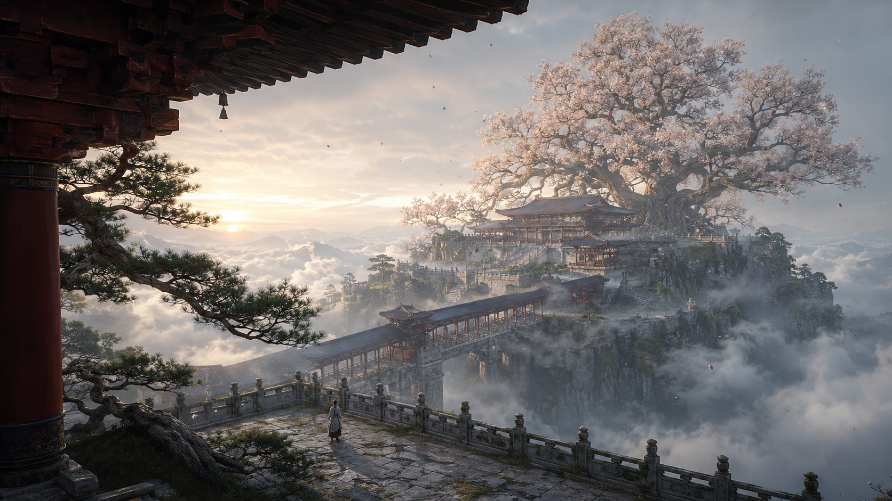
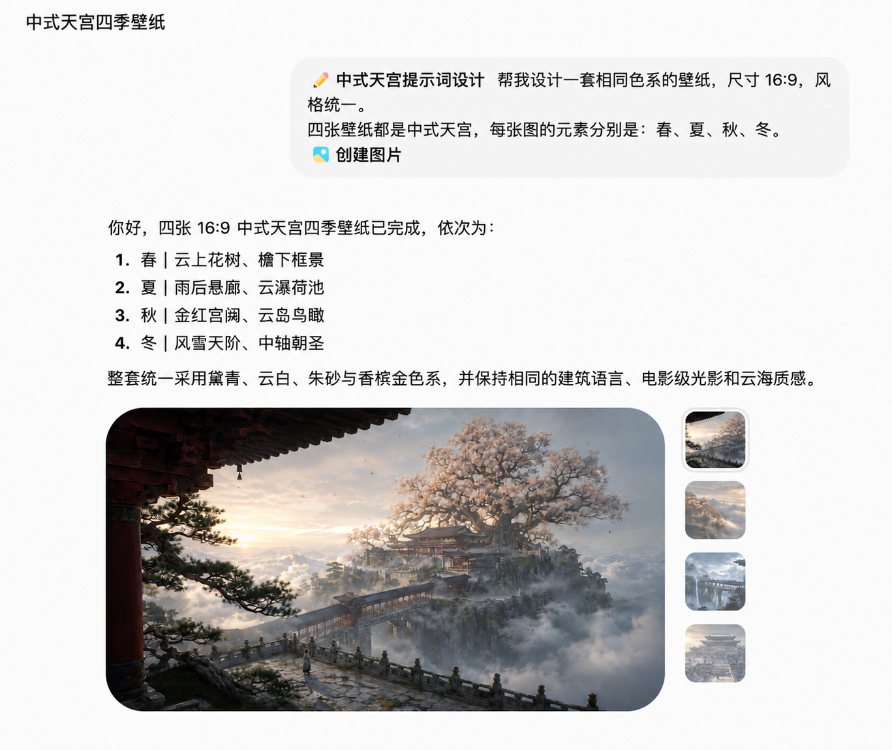

# Chinese Celestial Palace

把任意主题转译为电影级「中式天宫」构图、提示词与成图。

它不靠龙凤、灯笼、巨月和祥云堆砌东方感，而是用可信的中国木构、云海空间、尺度锚点、单一神迹与电影光线建立完整视觉语言。

## 效果展示

<table>
  <tr>
    <td align="center"><br><b>春｜云上花树</b></td>
    <td align="center"><br><b>夏｜雨后悬廊</b></td>
  </tr>
  <tr>
    <td align="center"><br><b>秋｜金红宫阙</b></td>
    <td align="center"><br><b>冬｜风雪天阶</b></td>
  </tr>
</table>

## 一句话完成系列视觉



上图为脱敏整理后的工作流示意，不包含账号、工作区、模型栏或个人昵称。

## 能做什么

- 从一句主题生成完整中式天宫视觉方案。
- 改写已有提示词，同时保留主体和硬约束。
- 诊断泛东亚建筑、塑料 CG、平面云贴图、人物漂浮和奇观过载。
- 设计 2 至 9 张同源但不重复的封面、壁纸或分镜。
- 直接调用宿主内置生图能力。
- 在用户明确指定时，调用 GPTX 兼容的第三方 Images API。

## 安装

```bash
git clone https://github.com/HeiGeAi/chinese-celestial-palace.git \
  ~/.codex/skills/chinese-celestial-palace
```

也可以下载仓库中的 ZIP，把目录放进当前 Agent 的 Skills 目录。

## 使用示例

```text
使用 $chinese-celestial-palace，把“失忆少年在天宫门外等天亮”做成 16:9 电影概念图。
```

```text
使用 $chinese-celestial-palace，直接生成四张春夏秋冬中式天宫壁纸，保持统一世界观。
```

默认直接生图走宿主内置图像工具，不会自动产生第三方 API 费用。

## GPTX 兼容 API

只有在用户明确要求 GPTX、第三方 API 或 OpenAI Images 兼容接口时才启用。

### 获取并安全配置 API Key

1. 打开 [GPTX.CC 官网](https://www.gptx.cc/) 注册并登录。官网当前标注新用户注册即送 5 美元体验额度，具体活动以官网和控制台实时显示为准。
2. 进入控制台创建自己的 API Key，并确认该 Key 可调用 `gpt-image-2`。
3. 不要把真实 Key 发进 AI 对话，也不要让 AI 把它写进 `AGENTS.md`、项目记忆或版本库。在运行 Agent 或脚本的同一终端中静默设置：

```bash
read -s "GPTX_API_KEY?粘贴 GPTX API Key：" && export GPTX_API_KEY && echo
```

设置完成后，只需告诉 Agent：「已设置，请用 GPTX 生图。」Key 只保留在当前终端会话中，关闭终端后需要重新设置。

如果使用的 Agent 产品提供 Secrets 或 Environment Variables 设置页，也可以在那里把变量名设为 `GPTX_API_KEY`，不需要把 Key 发给 Agent。

### 运行生图

```bash
python3 scripts/generate_image.py \
  --prompt-file /absolute/path/prompt.txt \
  --size 2048x1152 \
  --output /absolute/path/result.png
```

默认配置：

- Base URL：`https://api.gptx.cc/v1`
- Endpoint：`/images/generations`
- Model：`gpt-image-2`
- Response：优先读取 `data[0].b64_json`，同时兼容 HTTPS 图片 URL

可用 `GPTX_BASE_URL` 和 `GPTX_IMAGE_MODEL` 覆盖兼容服务。脚本固定每次生成一张，不自动重试，也不会把图像请求降级到 `/v1/chat/completions`。

## 安全边界

- API Key 只从环境变量读取，不写入 Skill、README、AGENTS.md、日志或版本库。
- 内置工具失败时，不会静默切换到收费的第三方服务。
- 第三方路径当前只支持文生图；参考图、蒙版和图片编辑继续使用宿主内置工具。
- 图片文件落盘前会检查响应结构、base64、文件签名和大小上限。

## 视觉方法

核心公式：

> 建筑负责秩序，云海负责留白，光线负责神性，自然负责诗意，人物负责尺度与叙事。

Skill 内含视觉 DNA、八种构图原型、提示词编译器、动态负面约束和 100 分质量门，可用于自然语言图像模型、Midjourney、FLUX、SDXL 与中文图像工作流。
